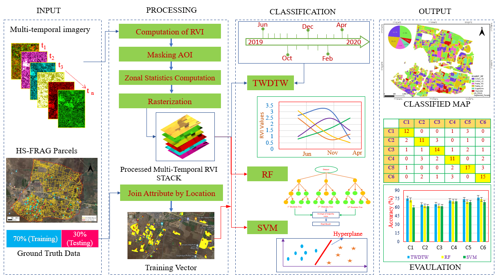

## ML-CLAS: An open-source, QGIS plug-in for crop classification in fragmented landscapes using SAR datasets

Conceptual framework used in the development of ‘ML-CLAS’ plugin for classification in fragmented landscapes.
 